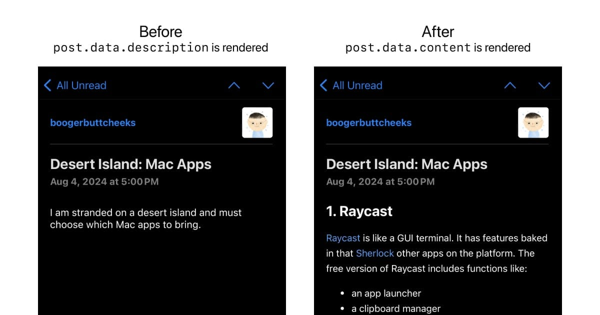

import { Aside, Steps } from "@astrojs/starlight/components";

By default, the RSS feed renders a post's description. You can use [sanitize-html](https://www.npmjs.com/package/sanitize-html) and [markdown-it](https://github.com/markdown-it/markdown-it) to render the full content of your posts in your RSS feed.



<Aside type="caution">
  This method is not compatible with `.mdx` files. Only use it with `.md` files.
</Aside>

<Steps>

1.  Install `sanitize-html` and `markdown-it`.

    ```shell
    npm install sanitize-html markdown-it
    ```

2.  Add the following to `src/pages/rss.xml.js`.

    ```js title="src/pages/rss.xml.js" ins={4-5, 7, 20-22}
    import rss from "@astrojs/rss";
    import { getCollection } from "astro:content";
    import { SITE } from "@siteConfig";
    import sanitizeHtml from "sanitize-html";
    import MarkdownIt from "markdown-it";

    const parser = new MarkdownIt();

    export async function GET(context) {
      const blog = await getCollection("blog");
      return rss({
        title: SITE.title,
        description: SITE.description,
        site: context.site,
        items: blog.map((post) => ({
          title: post.data.title,
          description: post.data.description,
          pubDate: post.data.publicationDate,
          link: `/blog/${post.slug}`,
          content: sanitizeHtml(parser.render(post.body), {
            allowedTags: sanitizeHtml.defaults.allowedTags.concat(["img"]),
          }),
        })),
      });
    }
    ```

</Steps>
